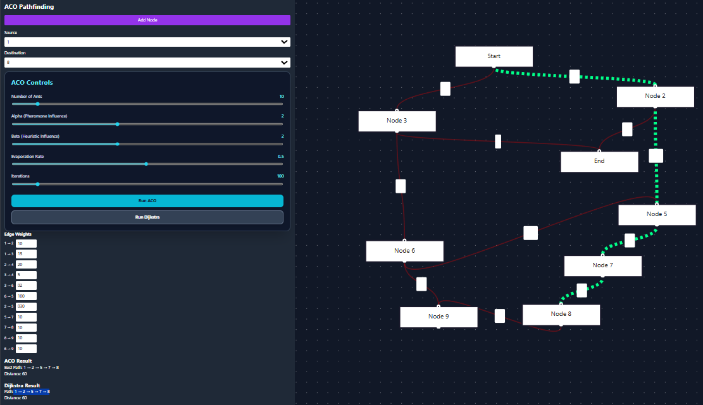

# Ant Colony Optimization Pathfinding Visualizer

This project is a full-stack application that visualizes the Ant Colony Optimization (ACO) algorithm for finding the shortest path in a graph. It includes an interactive graph editor, real-time visualization of the ACO simulation, and a comparison with Dijkstra's algorithm.



## Tech Stack

- **Backend:** Python, FastAPI
- **Frontend:** React, Tailwind CSS
- **Graph Visualization:** React Flow
- **Animation:** Framer Motion

## Features

- **Interactive Graph Editor:**
  - Add, remove, and drag nodes.
  - Add weighted edges between nodes.
  - Select source and destination nodes for pathfinding.
- **Ant Colony Optimization:**
  - Implements the core ACO logic with a pheromone matrix, heuristic visibility, and probabilistic transitions.
  - Parameters like the number of ants, alpha, beta, and evaporation rate are configurable.
- **Real-time Visualization:**
  - Ants are animated as they traverse the graph.
  - Edge thickness and color represent pheromone intensity.
  - The current best path found by the ACO is highlighted.
- **Controls:**
  - Start, pause, and reset the simulation.
  - Sliders to adjust ACO parameters dynamically.
- **Dijkstra Comparison:**
  - The application can also compute the shortest path using Dijkstra's algorithm to verify the ACO results.

## Project Structure

```
/
├── backend/
│   ├── app/
│   │   ├── api/
│   │   ├── core/
│   │   ├── models/ (ACO, Ant, Graph classes)
│   │   └── services/ (ACO and Graph services)
│   ├── requirements.txt
│   └── ...
└── frontend/
    ├── public/
    ├── src/
    │   ├── components/ (React components for Graph, Controls)
    │   └── ...
    ├── package.json
    └── ...
```

## Setup and Installation

### Backend (FastAPI)

1.  **Navigate to the backend directory:**
    ```bash
    cd backend
    ```

2.  **Create a virtual environment:**
    ```bash
    python -m venv venv
    source venv/bin/activate  # On Windows use `venv\Scripts\activate`
    ```

3.  **Install dependencies:**
    ```bash
    pip install -r requirements.txt
    ```

4.  **Run the backend server:**
    ```bash
    uvicorn app.main:app --reload
    ```
    The backend will be running at `http://localhost:8000`.

### Frontend (React)

1.  **Navigate to the frontend directory:**
    ```bash
    cd frontend
    ```

2.  **Install dependencies:**
    ```bash
    npm install
    ```

3.  **Run the frontend development server:**
    ```bash
    npm start
    ```
    The frontend will be running at `http://localhost:3000`.

## ACO Formulas Used

### 1. Heuristic Visibility (η)

The heuristic value (or visibility) of moving from node `i` to node `j` is the inverse of the distance between them. This encourages ants to prefer shorter edges.

$$ \eta_{ij} = \frac{1}{d_{ij}} $$

Where `d_ij` is the distance (weight) of the edge between node `i` and `j`.

### 2. Transition Probability (p)

The probability of an ant `k` at node `i` choosing to move to node `j` is calculated based on the pheromone level and the heuristic value of the edge.

$$ p_{ij}^k = \frac{[\tau_{ij}]^\alpha \cdot [\eta_{ij}]^\beta}{\sum_{l \in N_i^k} [\tau_{il}]^\alpha \cdot [\eta_{il}]^\beta} $$

- `τ_ij` is the amount of pheromone on the edge `(i, j)`.
- `η_ij` is the heuristic value of the edge `(i, j)`.
- `α` (alpha) is the pheromone influence parameter.
- `β` (beta) is the heuristic influence parameter.
- `N_i^k` is the set of unvisited neighboring nodes of node `i` for ant `k`.

### 3. Pheromone Update

Pheromones are updated after each iteration. This involves two steps: evaporation and deposition.

#### a. Evaporation

All pheromone trails are reduced by a certain factor to avoid premature convergence and to allow exploration of new paths.

$$ \tau_{ij} \leftarrow (1 - \rho) \cdot \tau_{ij} $$

Where `ρ` (rho) is the evaporation rate (0 < ρ ≤ 1).

#### b. Deposition

Ants that have completed a tour deposit pheromones on the edges they traversed. The amount of pheromone deposited is inversely proportional to the total distance of the path.

$$ \Delta\tau_{ij}^k = \begin{cases} \frac{Q}{L_k} & \text{if edge (i, j) is in ant k's path} \\ 0 & \text{otherwise} \end{cases} $$

- `Q` is a constant pheromone deposit factor.
- `L_k` is the total distance of the path taken by ant `k`.

The total pheromone update is the sum of the initial pheromone (after evaporation) and the newly deposited pheromone.

$$ \tau_{ij} \leftarrow \tau_{ij} + \sum_{k=1}^{m} \Delta\tau_{ij}^k $$

Where `m` is the number of ants.
